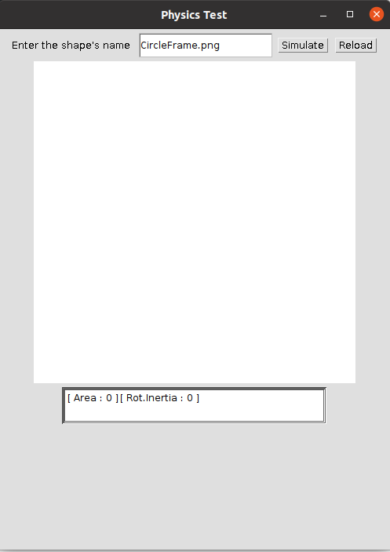
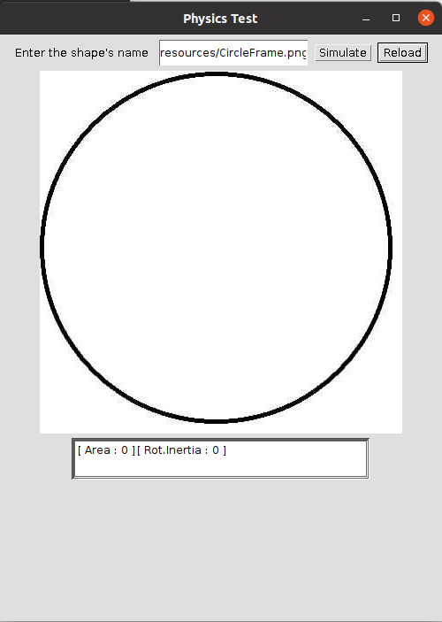
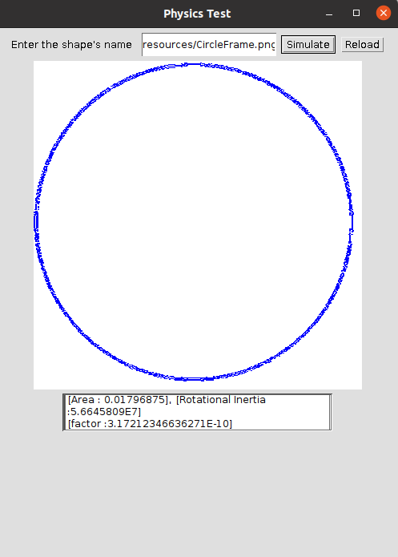

# image-rotational-inertia
This repo is the archive of my physics project done in highschool. It tests all the orientations and dimensions of the motor ring and tests the rotaional inertia.

# Instructions

### Compile and start the program

1. move to the directory you downloaded.

2. type the followings in the terminal/cmd.

```shell
javac Physics.java
java Physics  
```

3. The following graphic interface will show up.



### Load the image

1. type in the image path you want to simulate, then press `Reload`.




2. When the image is loaded, press `Simulate` to check the inertia.


